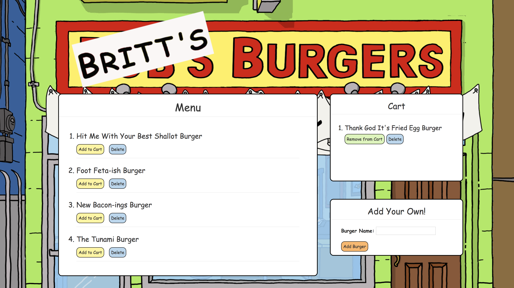

# Britt's Burgers

## Project Overview

A simple full stack web application using Node, Express, Handlebars to generate HTML, MySQL to store burger information and a custom ORM to query the database. The restaurant menu app allows users to select a burger from the menu and add it to their Cart, or create a custom burger. 

Check it out [here](https://afternoon-crag-12041.herokuapp.com/)!

[Photo cred](https://cdn.sdccblog.com/wp-content/uploads/2017/03/10214323/reopen-2017.jpg)
